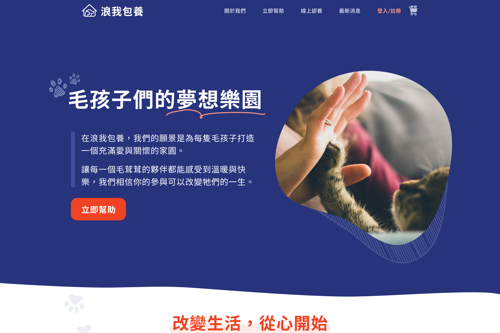

# 浪我包養 (Nurture Me)

浪我包養是一個專注於幫助流浪貓狗的線上贊助平台，使用者可以瀏覽網站上的動物資料並選擇贊助特定的動物。透過這個平台，我們希望為流浪動物帶來更多的關注和支持。

## 專案展示

### ✨ [Demo](https://Maojin-juan.github.io/NurtureMe/)



## 特色功能

- 查看流浪動物的詳細資料，包含圖片、故事、和需求
- 使用者可以選擇贊助特定動物，追蹤贊助進度
- 查看每月財務報表和贊助狀態
- 提供線上捐款功能
- 響應式設計，支援手機瀏覽

## Node.js 版本需求

- **最低版本**: v16.0.0+
- **建議版本**: v20.x
- **目前開發環境**: v20.17.0

> 💡 專案使用 Vite + React 18，需要 Node.js 16+ 以確保所有功能正常運作

## 使用技術

- **開發和打包工具**: Vite
- **CSS 框架**: Tailwind CSS
- **前端框架**: React.js
- **狀態管理**: React Context
- **路由管理**: React Router
- **語言**: HTML, CSS, JavaScript
- **套件管理**: npm
- **版本控制**: Git
- **程式碼格式化**: Prettier
- **UI 元件**: Sweet Alert2
- **API 管理**: Axios
- **表單處理**: React Hook Form

## 安裝與執行

### 1. 安裝前準備

- 安裝 [Node.js](https://nodejs.org/) 版本要求：
  - 建議版本：`v16.x` 以上
  - 專案開發環境：`v20.17.0`

> 💡 Note: 本專案使用 Vite + React 18 開發，需要 Node.js v16 以上版本才能正常運作。

### 2. 下載專案

```bash
git clone https://github.com/Maojin-juan/NurtureMe.git
cd NurtureMe
```

### 3. 安裝相依套件

```bash
npm install
```

### 4. 啟動開發伺服器

```bash
npm run dev
```

開發伺服器會在 `http://localhost:5173` 運行。

## 資料夾結構

```bash
NurtureMe/             # 浪我包養
│
├── src/                # 源碼目錄
│   ├── assets/         # 靜態資源
│   ├── components/     # 共用元件
│   ├── pages/         # 頁面元件
│   └── contexts/      # Context 相關
├── public/            # 公開資源
├── .prettierrc        # Prettier 配置
├── package.json       # 專案配置
├── README.md          # 說明文件
├── tailwind.config.js # Tailwind 配置
└── vite.config.js     # Vite 配置
```

## Author

👤 **Shiloh**

- Github: [@MinMinTW](https://github.com/MinMinTW)

👤 **Morning**

- Github: [@Morning1996](https://github.com/Morning1996)

👤 **毛巾**

- Github: [@Maojin-juan](https://github.com/Maojin-juan)

👤 **Kevin Huang**

- Github: [@KevinHuanggg](https://github.com/KevinHuanggg)

## Show your support

Give a ⭐️ if this project helped you!

---
